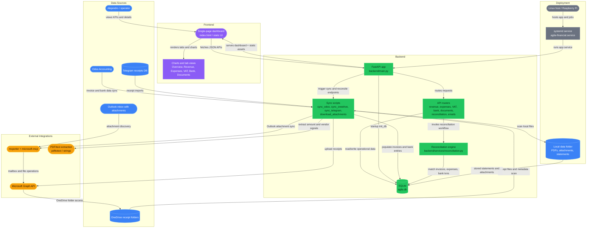

# Agila Financial Dashboard

Financial operations dashboard for Agila Consulting SARL. The solution combines a FastAPI backend, SQLite data model, lightweight HTML/JS frontend, and operational sync scripts for Odoo, OneDrive, Telegram, Outlook attachments, and reconciliation workflows.

## Solution Overview

- **Revenue visibility** from Odoo invoices and receivables
- **Expense capture** from OneDrive accounting folders, Telegram receipt intake, and email attachments
- **Bank reconciliation** against synced Odoo bank entries
- **VAT tracking** with Luxembourg-specific recovery logic
- **Document visibility** for receipts and accounting folders
- **Single-screen operator UI** served from the same app stack

## Architecture



## Component Breakdown

### Data sources
- **Odoo** provides posted outbound invoices and bank statement lines.
- **OneDrive** is the accounting source of truth for receipts, invoices, and supporting documents.
- **Telegram receipts DB** feeds receipt captures into the expenses workflow.
- **Outlook inbox attachments** extend document intake for invoices and receipts received by email.
- **Local data files** hold statements, sample PDFs, downloaded attachments, and working artifacts.

### Backend
- **`backend/main.py`** initializes FastAPI, mounts static assets, and exposes summary + health endpoints.
- **Routers** split responsibility cleanly by domain:
  - `revenue.py`
  - `expenses.py`
  - `vat.py`
  - `bank.py`
  - `documents.py`
  - `reconciliation.py`
  - `emails.py`
- **SQLite (`agila.db`)** stores invoices, expenses, bank transactions, VAT returns, sync logs, companies, and reconciliation data.
- **Reconciliation engine** matches bank movements to invoices and expenses using amount, date proximity, and fuzzy vendor matching.

### Frontend
- **`index.html` / `static/index.html`** provides a dark-themed single-page dashboard.
- Frontend tabs cover **Overview, Revenue, Expenses, VAT, Reconciliation, and Documents**.
- The UI triggers operational actions such as **Sync Now** and renders charts with Chart.js.

### Integrations and automation
- **`scripts/sync_odoo.py`** imports invoices and bank entries from Odoo.
- **`scripts/sync_onedrive.py`** scans receipt folders and infers metadata from filenames.
- **`scripts/sync_telegram.py`** imports Telegram receipts into the expense ledger.
- **`scripts/download_attachments.py` / `backend/routers/emails.py`** handle Outlook attachment download and OneDrive upload flows.
- **mcporter + microsoft-mcp + Graph API** provide Outlook and OneDrive access.
- **PDF parsing utilities** extract amounts from invoice and receipt documents.

### Deployment
- **`agila-financial.service`** runs the application as a Linux service.
- The solution is designed to run on a lightweight host with local SQLite storage and scheduled/triggered sync operations.

## Repository Structure

```text
agila-financial-dashboard/
├── backend/
│   ├── main.py
│   ├── routers/
│   └── services/
├── scripts/
├── static/
├── data/
├── database.py
├── models.py
├── index.html
└── agila-financial.service
```
